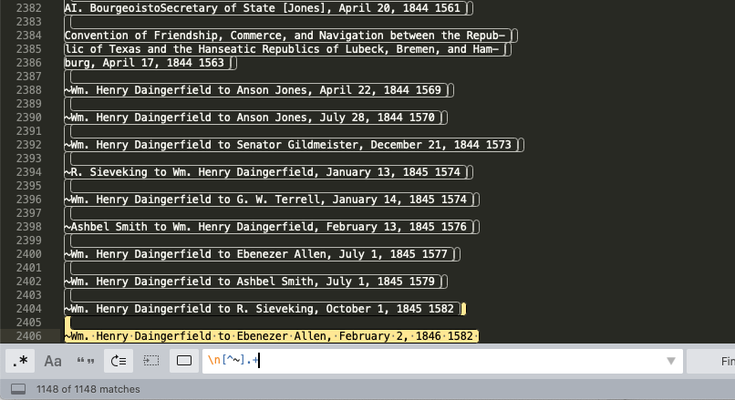
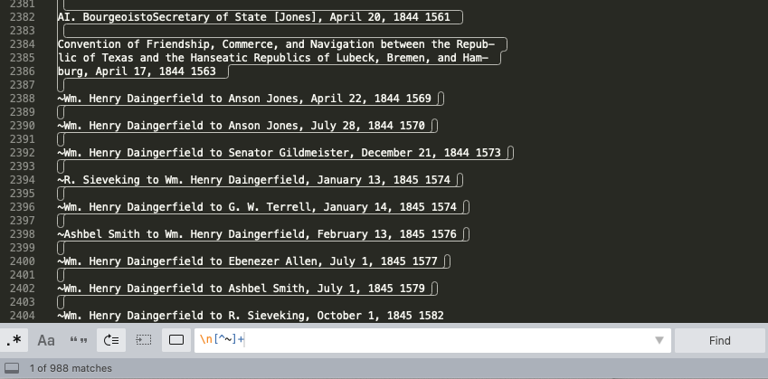
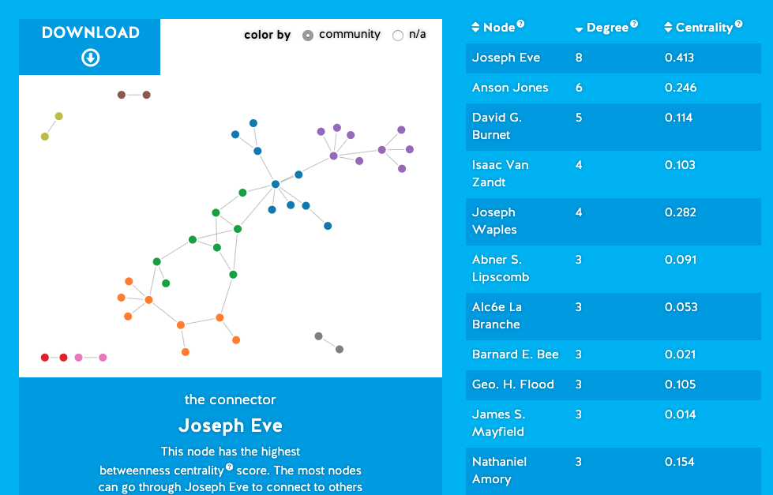
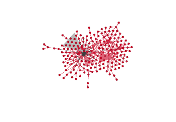

# Week Three Notes

## REGEX
- [cheatsheet for regular expressions in Sublime](https://jdhao.github.io/2019/02/28/sublime_text_regex_cheat_sheet/)
- `|` means "or"
- when terms are separated by spaces, it defines it as a complete word
- `\<` or `\b` means the beginning of a word
- `\>` or `\b` for patterns at the end of the line
- can use parentheses to look for variations of a single word
- original search wasn't working: 
- played around with the critera individually and found that find: `\n[^~]+` replace: `\n` worked: 
- asked in discord and learned that `\n` meant that the remaining text would stay in its line rather than turning into one giant block of text

## Open Refine
- no errors

## Networks
- got an error when uploading: 
- couldn't find anything specific to databasic.io when I looked up the error message
- copied and pasted about the first 90 rows and got this result: 
- network visualization in Gephi worked well, no errors, with this result: 

- didn't do network analysis in python, might go back to it

## bonus activity
- "one-mode network" vs "two-node network" ...
- all about the questions that you ask as you look at the visualizations
- how do the visualizations help you think about the data? what do they tell us about the relationships of those people? what impact does that have to our study of the time period?
