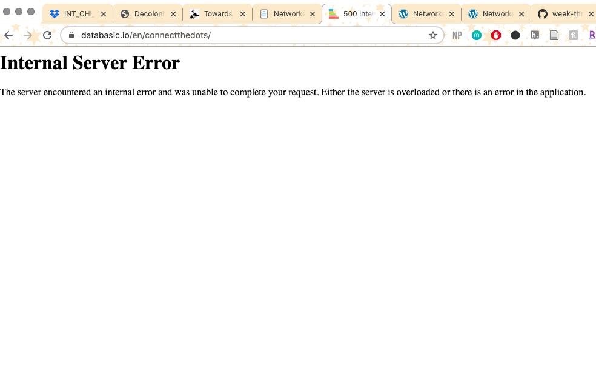

# Week Three Notes

## REGEX
- [cheatsheet for regular expressions in Sublime](https://jdhao.github.io/2019/02/28/sublime_text_regex_cheat_sheet/)
- original search wasn't working: 
- played around with the critera individually and found that find: `\n[^~]+` replace: `\n` worked: 
- asked in discord and learned that `\n` meant that the remaining text would stay in its line rather than turning into one giant block of text
- very useful for finding and replacing portions of text to clean up data
- will use this in future research where I need to go though a lot of data

## Open Refine
- no errors
- easy to navigate and I enjoy the ability to look through the clusters manually if I need to
- I can see why it would be very helpful for cleaning up data, especially when used with REGEX 

## Networks
- got an error when uploading: 
- couldn't find anything specific to databasic.io when I looked up the error message
- copied and pasted about the first 90 rows and got this result: 
- 
- network visualization in Gephi worked well, no errors, with this result: 

- used the [webiste](http://hdlab.stanford.edu/palladio-app/#/upload) and instructions that Dr. Graham posted on Discord, which worked with this result:

- tried to do the network visualization in python but couldn't properly run the code on Sublime
- I got this error message: 
- when I looked up the error, I found someone with a similar issue on [Stackoverflow](https://stackoverflow.com/questions/31982800/installing-issues-in-networkx), but it didn't work when I tried it
- since I was able to do visualizations of Gephi and Palladio, I probably won't worry about figuirng out how to use python, because I am having trouble navigating and running it. But, I might go back to the turorial and try it again later.

## bonus activity
- "one-mode network" vs "two-node network" ...
- all about the questions that you ask as you look at the visualizations
- how do the visualizations help you think about the data? what do they tell us about the relationships of those people? what impact does that have to our study of the time period?
